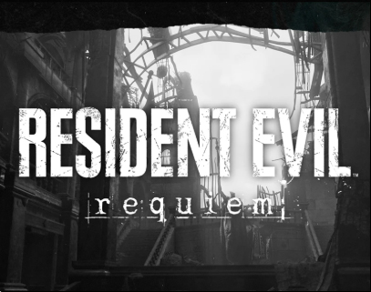
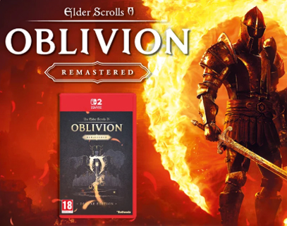
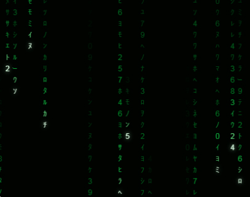
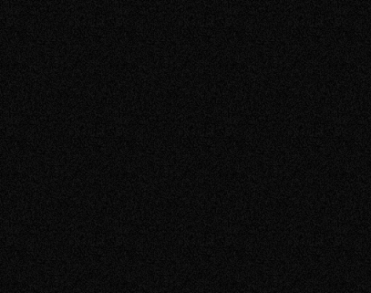
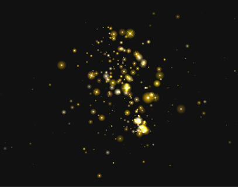

<h1 align="center">
  Hola, soy
  <a href="https://www.behance.net/adori">
    Adrián
  </a>
</h1>

  

<h2 align="center">Conecta conmigo</h2>

  

  

  

  

 

<h2 align="center">Tecnologías y herramientas</h2>

  
  
  
  
  

  
  
  
  
  

<h2 align="center">Sobre mí</h2>

  Soy un profesional híbrido especializado en e-commerce, gestión de producto y diseño digital.
  Combino estrategia comercial, merchandising digital, diseño gráfico y tecnología para mejorar
  la presentación, visibilidad y rendimiento de productos digitales.

  En este portfolio encontrarás proyectos de diseño para e-commerce, landings, newsletters,
  automatización de procesos y desarrollo web con HTML, CSS, JavaScript, Python y SQL.

<h2 align="center">Proyectos destacados</h2> 

Una selección de proyectos donde combino diseño visual, e-commerce y desarrollo web.

| **Resident Evil Requiem** | **Newsletter xtralife** | **Matrix Code Rain** |
|:---:|:---:|:---:|
| [ ](https://thenomadwarlock.github.io/re-requiem-xtralife-adrianhp.es/) | [ ](https://thenomadwarlock.github.io/newsletter-xtralife/) | [ ](https://thenomadwarlock.github.io/matrix-code-rain-adrian/) |
| Landing promocional para e-commerce centrada en jerarquía visual, presentación de producto y experiencia responsive.  `HTML` `CSS` `JavaScript`   | Diseño y desarrollo de newsletters comerciales con banners, contenido promocional y maquetación orientada a conversión.  `HTML` `CSS` `Diseño gráfico`   | Experimento visual inspirado en Matrix con animación generativa, columnas dinámicas y efectos desarrollados con JavaScript.  `JavaScript` `Canvas` `CSS`   |
| **Animated Noise** | **Gold Particles** | &nbsp; |
| [ ](https://thenomadwarlock.github.io/animated-noise/) | [ ](https://thenomadwarlock.github.io/gold-particles/) | &nbsp; |
| Experimento visual generativo basado en ruido animado, textura dinámica y partículas ambientales renderizadas mediante Canvas.  `JavaScript` `Canvas` `CSS`   | Sistema interactivo de partículas doradas con animaciones pulsantes, respuesta al movimiento del cursor y generación de ráfagas mediante interacción.  `JavaScript` `Canvas` `CSS`   | &nbsp; |
